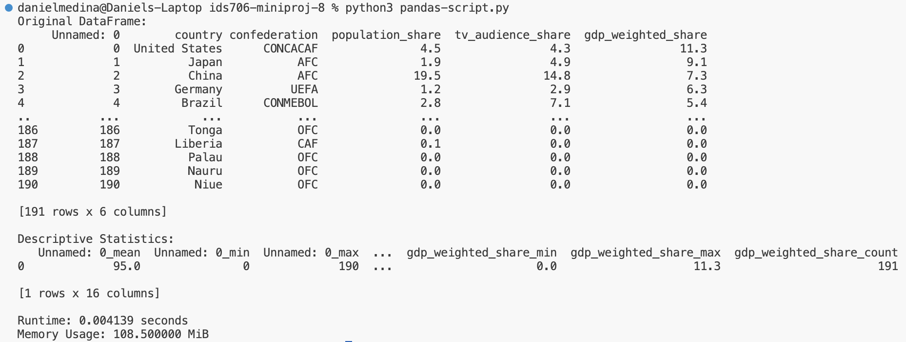
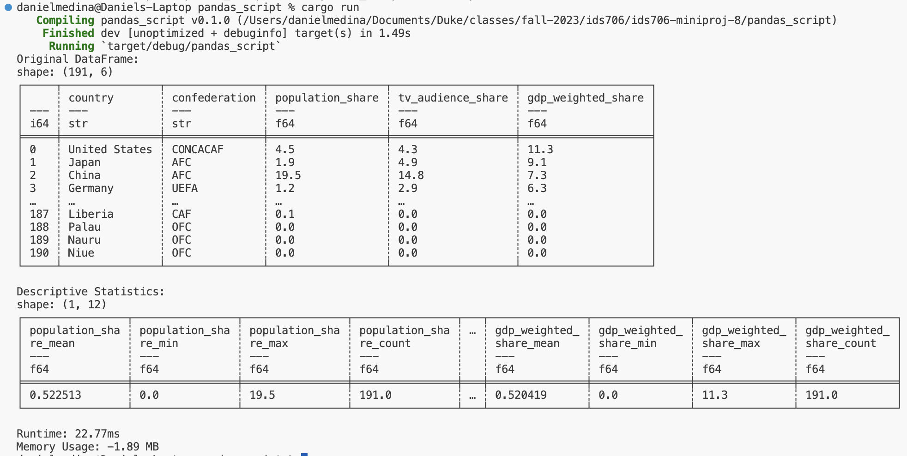

# IDS 706 Mini-project 8
### By Daniel Medina

## Description
In this mini project I am re-writing a Python descriptive statistics script in Rust.
I am using data from a FIFA CSV file.

The descriptive statistics include the mean, minimum, maximum, count, mean, median, and mode for each of the columns in the dataset.

I am also comparing the performance of the two different scripts.

## Performance Comparison
As shown below, the runtime for Python was 4.139 ms and the runtime for Rust was 22.77 ms. The memory usage for Python was 108.5 MB and the memory usage for Rust was -1.89 MB. The Python script was faster but also used more memory.

